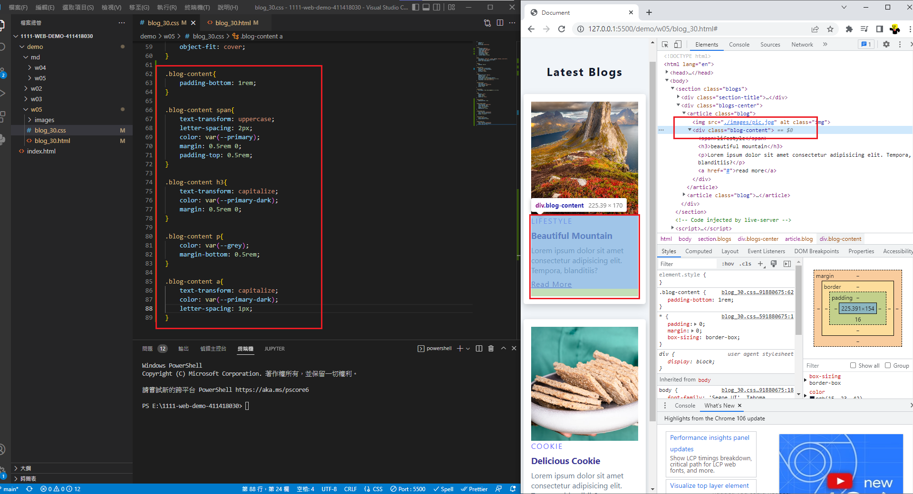
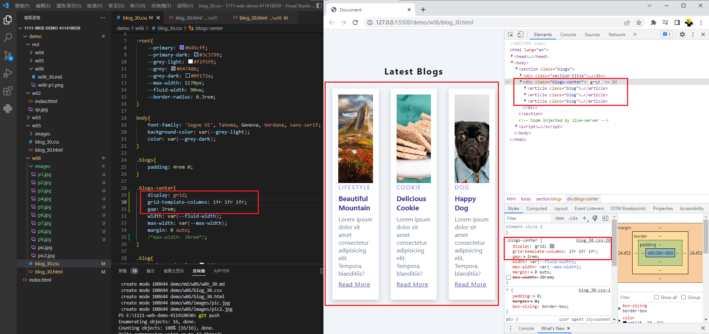
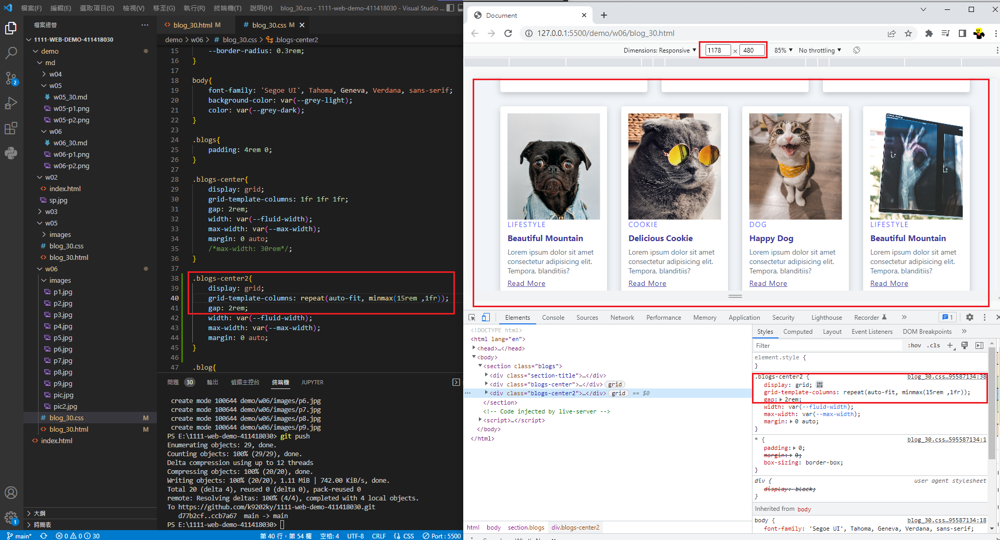
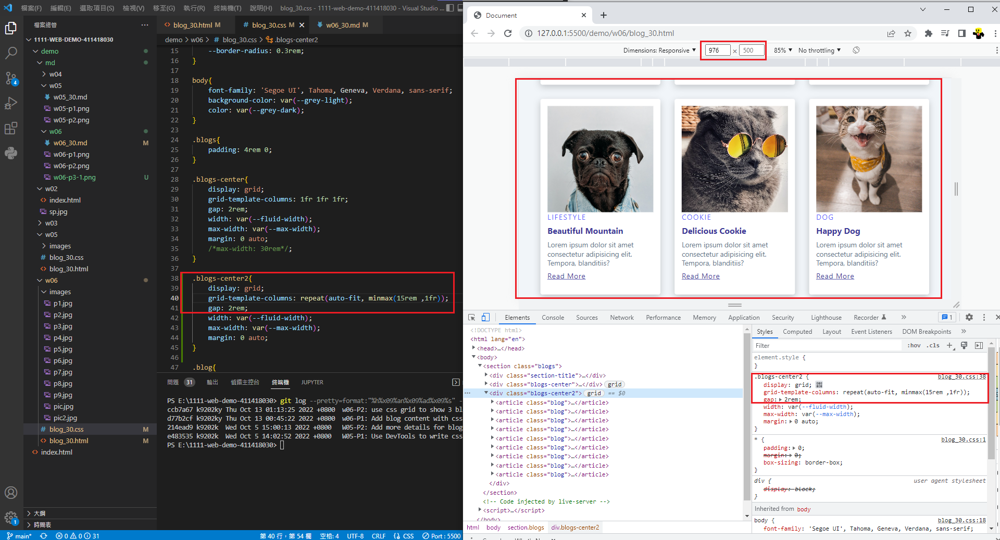
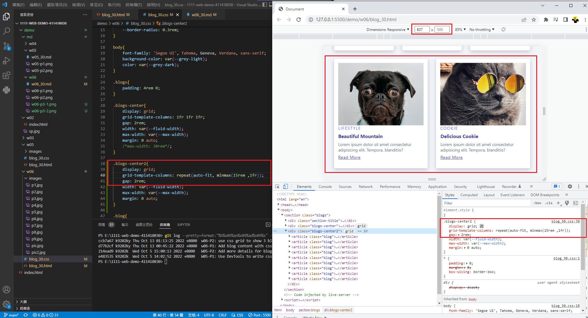
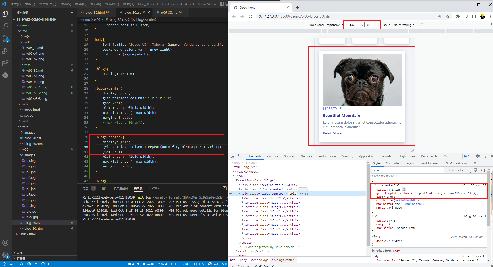

### Github URL

[Github URL](https://github.com/k9202ky/1111-web-demo-411418030)

### Vercel URL

[Vercel URL](https://1111-web-demo-411418030-8j4p.vercel.app/)

### W06-P1: Add blog content with css



### W06-P2: use css grid to show 3 blogs



### W06-P3: use css grid (minmax) to show 9 blogs









### W06-logs: W6 all logs

```
$ git log --pretty=format:"%h%x09%an%x09%ad%x09%s" --after="2022-10-04"
ccb7a67 k9202ky Thu Oct 13 01:13:25 2022 +0800  w06-P2: use css grid to show 3 blogs
d77b2cf k9202ky Thu Oct 13 00:45:22 2022 +0800  w06-P1: Add blog content with css
214ead9 k9202k  Wed Oct 5 15:00:13 2022 +0800   W05-P2: Add more details for blog class selector
e483535 k9202k  Wed Oct 5 14:02:52 2022 +0800   W05-P1: Use DevTools to write css with img class selector
```
