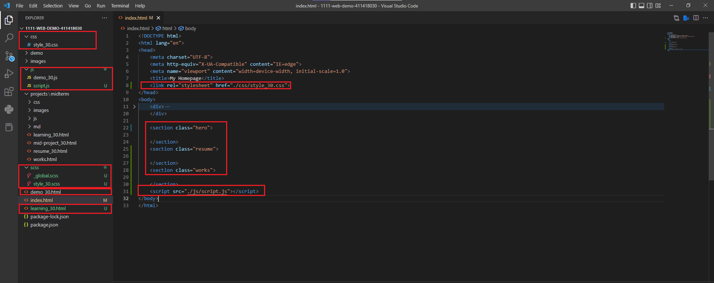
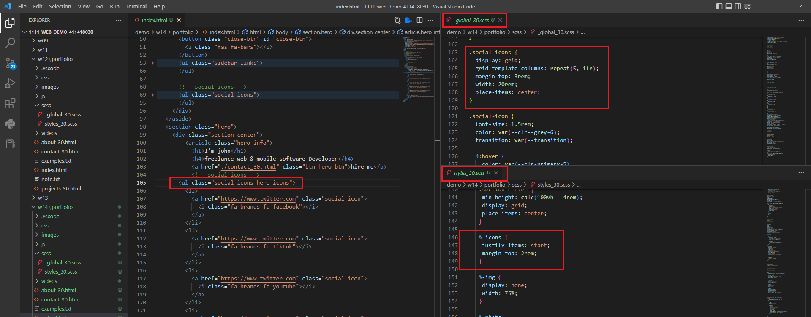
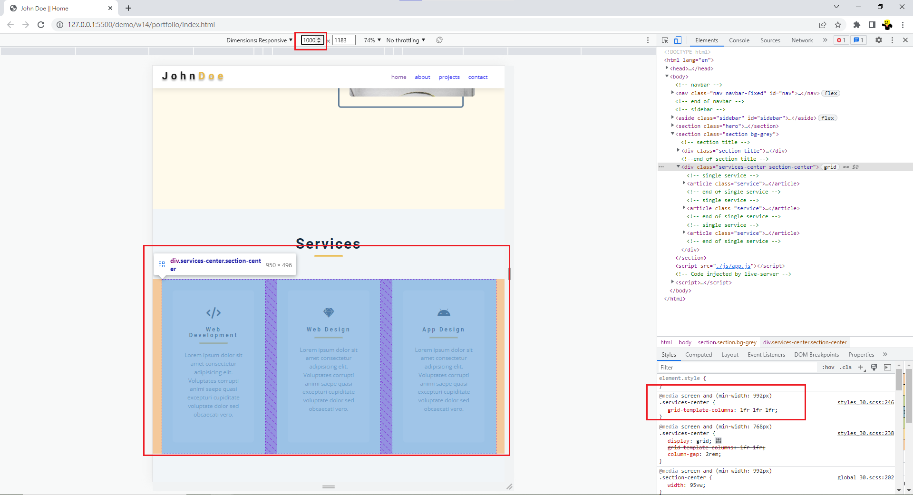
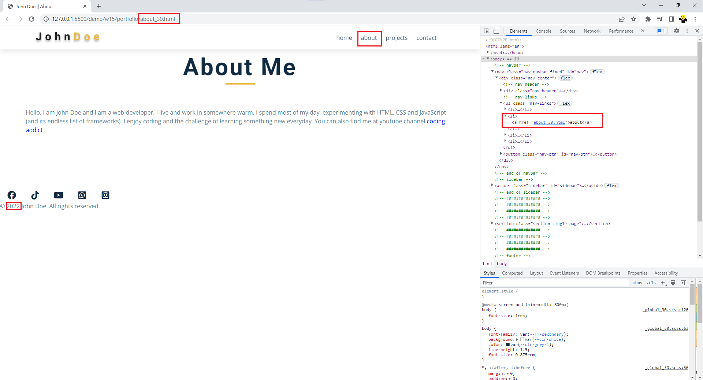
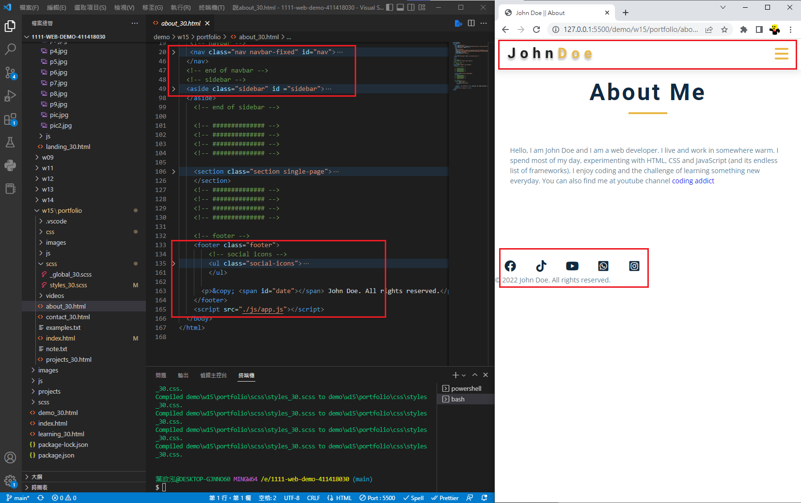
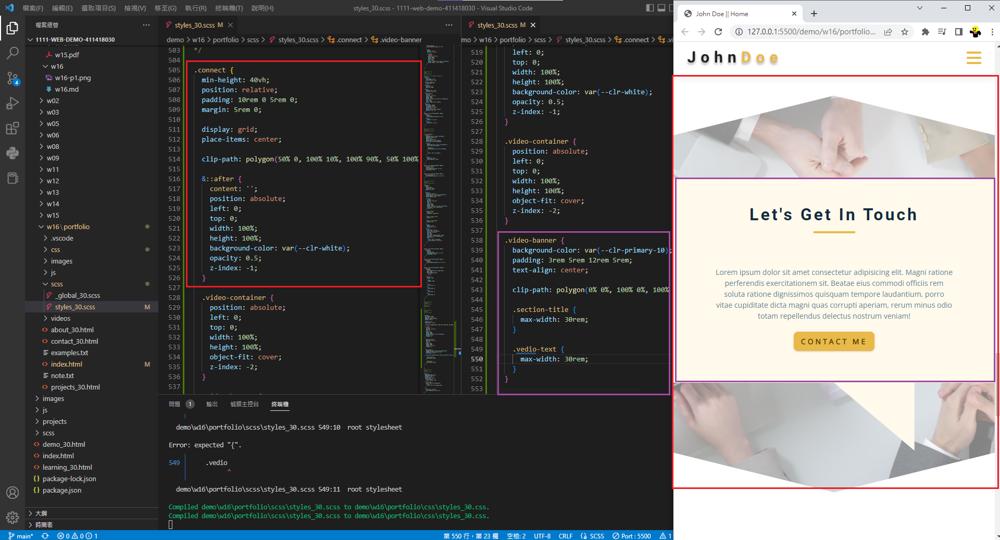

## Github & Vercel URL

[Github URL](https://github.com/k9202ky/1111-web-demo-411418030)

[Vercel URL](https://1111-web-demo-411418030-8j4p.vercel.app/)

### w14-P1: file structures for final project



### w14-P2: social icons using global css, and custom css



### w14-P3: Services section with responsive design with phone, pad and desktop computer




### w14-P4: finish About section with responsive design with phone, and desktop computer


### W14-logs: W14 all logs


```
00b42bc k9202ky Sun Dec 11 23:18:52 2022 +0800  w14-P4: finish About section with responsive design with phone, and desktop computer
a450644 k9202ky Sun Dec 11 22:46:50 2022 +0800  w14-P3: Services section with responsive design with phone, pad and desktop computer
9aef800 k9202ky Sun Dec 11 21:59:31 2022 +0800  w14-P2: social icons using global css, and custom css
a0630f1 k9202ky Sun Dec 11 21:09:05 2022 +0800  w14-P1: file structures for final project
```

### w15-P1: nav link to about page with navbar and footer





### w15-P2: Latest works using grid-template-areas


### W15-logs: W15 all logs


```
2eb3ee2 k9202ky Mon Dec 26 18:23:39 2022 +0800  w15-P2: Latest works using grid-template-areas
dbafd6d k9202ky Mon Dec 26 16:55:02 2022 +0800  nav link to about page with navbar and footer

```

### w16-P1: show how to show odd number timeline


### w16-P2:connect section using clip-path



### W16-logs: W16 all logs


```
69678a8 k9202ky Wed Dec 28 03:02:07 2022 +0800  w16-P2:connect section using clip-path
aabed83 k9202ky Wed Dec 28 02:10:41 2022 +0800  w16-P1: show how to show odd number timeline

```

### w11~w17 git log


