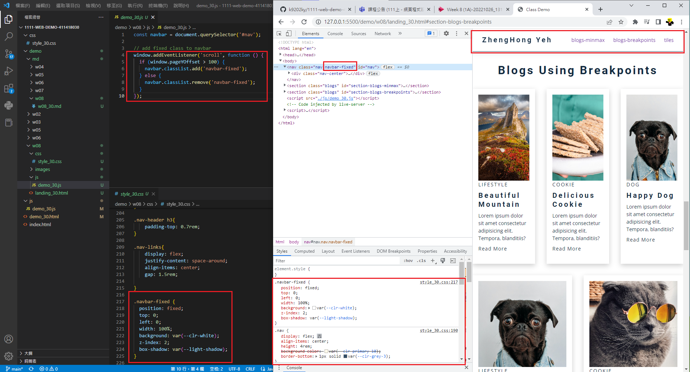
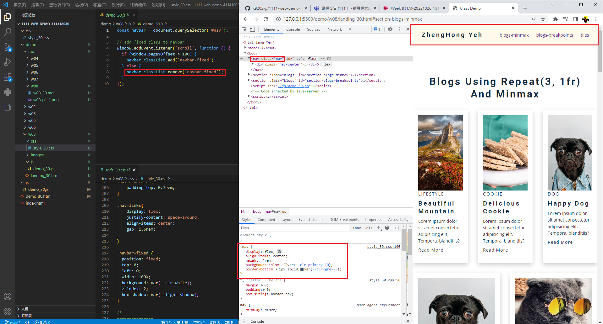
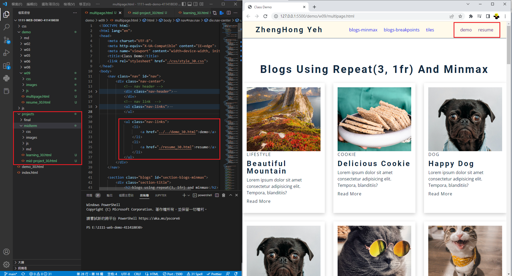
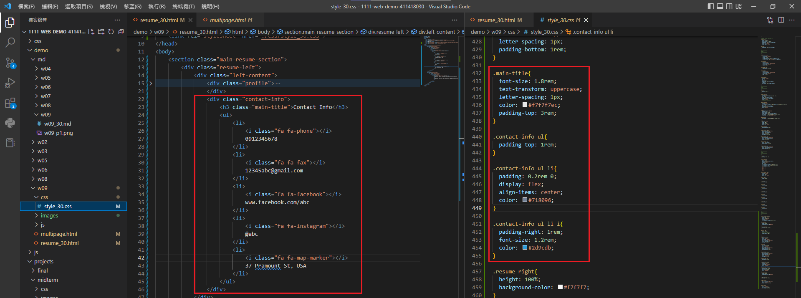
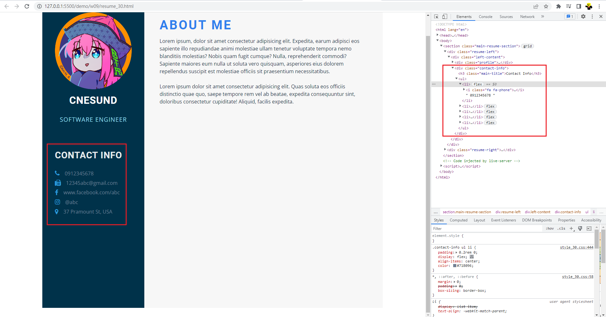
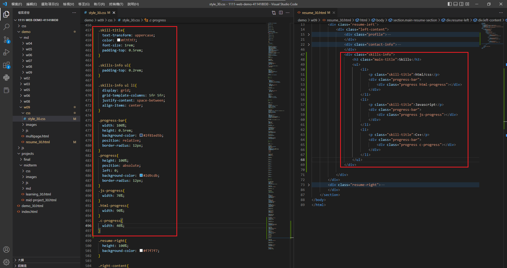
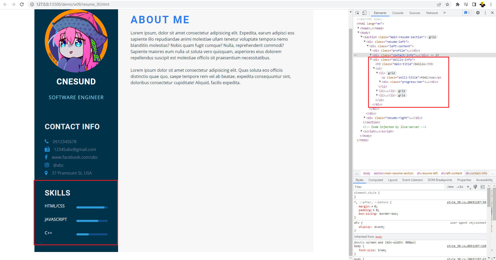
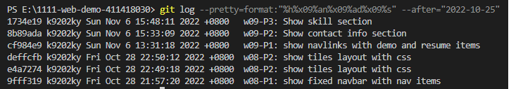

### Midterm-project.html

[Github URL](https://github.com/k9202ky/1111-web-demo-411418030/blob/main/projects/midterm/mid-project_30.html)

[Vercel URL](https://1111-web-demo-411418030-8j4p.vercel.app/projects/midterm/mid-project_30.html)

### 1.CONNECT TO DEMO

[Github URL](https://github.com/k9202ky/1111-web-demo-411418030/blob/main/demo_30.html)

[Vercel URL](https://1111-web-demo-411418030-8j4p.vercel.app/demo_30.html)

### W08 and W09 Homeworks

### w08-P1: show fixed navbar with nav items





### w08-P2: show tiles layout with css


### w09-P1: show navlinks with demo and resume items



### w09-P2: Show contact info section





### w09-P3: Show skill section





### W09-logs: W9 all logs



```
1734e19 k9202ky Sun Nov 6 15:48:11 2022 +0800   w09-P3: Show skill section
8b89ada k9202ky Sun Nov 6 15:33:09 2022 +0800   w09-P2: Show contact info section
cf984e9 k9202ky Sun Nov 6 13:31:18 2022 +0800   w09-P1: show navlinks with demo and resume items
deffcfb k9202ky Fri Oct 28 22:50:12 2022 +0800  w08-P2: show tiles layout with css
e4a7274 k9202ky Fri Oct 28 22:49:18 2022 +0800  w08-P2: show tiles layout with css
9fff319 k9202ky Fri Oct 28 21:57:20 2022 +0800  w08-P1: show fixed navbar with nav items
```

### 2.WORKS

[Github URL](https://github.com/k9202ky/1111-web-demo-411418030/blob/main/projects/midterm/works.html)


[Vercel URL](https://1111-web-demo-411418030-8j4p.vercel.app/projects/midterm/works.html)

### 3.RESUME

[Github URL](https://github.com/k9202ky/1111-web-demo-411418030/blob/main/projects/midterm/resume_30.html)

[Vercel URL](https://1111-web-demo-411418030-8j4p.vercel.app/projects/midterm/resume_30.html)

### 4.LEARNING

[Github URL](https://github.com/k9202ky/1111-web-demo-411418030/blob/main/projects/midterm/learning_30.html)

[Vercel URL](https://1111-web-demo-411418030-8j4p.vercel.app/projects/midterm/learning_30.html)
